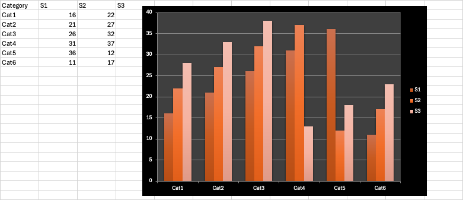
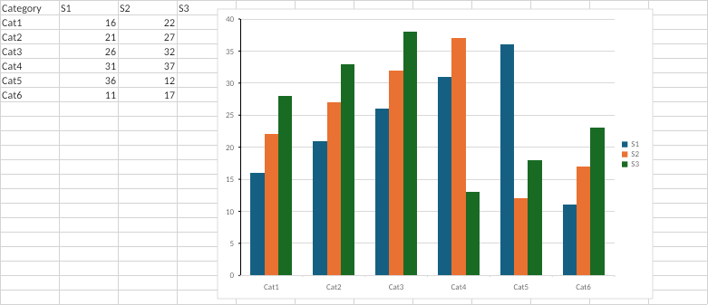
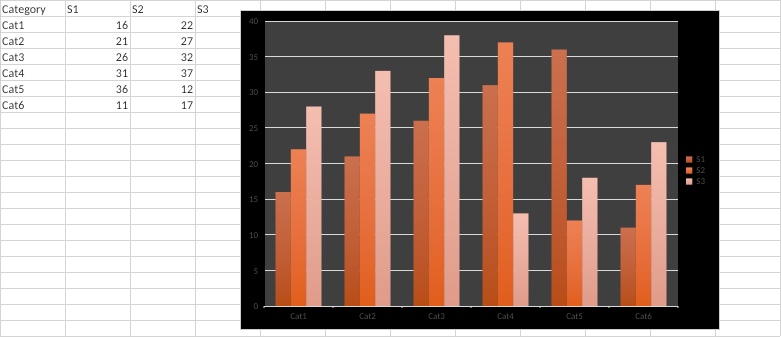
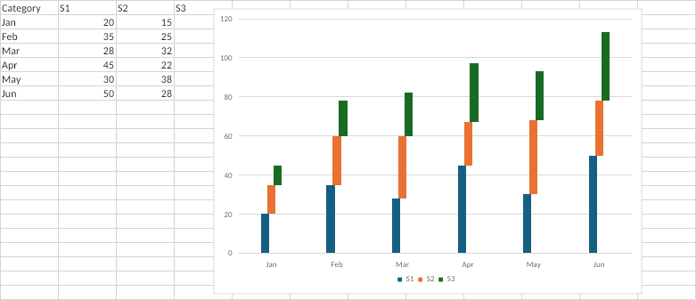
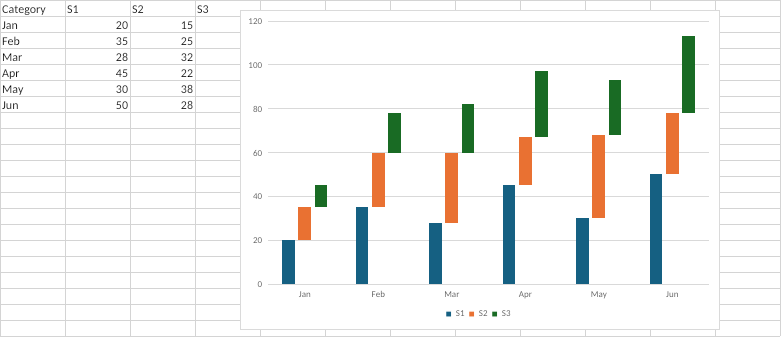

# Grinding chart rendering against Excel

*Second in a series of practical examples of [Loop Driven Development](README.md) (the first covered [building a corpus benchmark](ldd-in-practice.md)). This one is about a domain where equality assertions don't exist: making headlessly-rendered charts look like Excel. The work lives in our engine repo, so unlike the corpus bench there's nothing to link — but the mechanics, the numbers, and the pictures are all below.*

Our engine renders charts to pixels without Office installed: it reads the chart's OOXML, lays out axes and series and legends, and draws the result. The correctness question is "does this look like what Excel would draw?" — and that question resists the kind of per-behavior equality assertions we used for formula evaluation. There is no cell you can compare. A bar chart is a few hundred thousand pixels, and Excel's exact output depends on layout decisions, color theming, font rasterization, and a long tail of defaults that the spec describes only loosely.

In the LDD post we called this the distance-assertion case: when clean equality isn't available, assert a distance against the oracle's output and drive it down. This post is what that looks like in production — the oracle setup, the grading function, the gate that protects progress, and what one focused week of grinding against it achieved.

## The oracle, used twice

The first thing worth copying from this setup is that Excel is the oracle on *both ends* of the pipeline.

On the input end, the test fixtures themselves are authored by Excel. Early fixture workbooks were built with openpyxl, which meant we were testing our renderer against files that approximated what Excel writes. That got replaced wholesale: a small tool (`excel-vba-run`) executes a VBA script inside real Excel on macOS, so each chart family — pie, bar, area, axis, legend, trendline, and so on, 21 families — has a `.bas` script that drives Excel to create its fixture workbook. The files we test against are files Excel wrote.

Each family also has a design doc that derives the fixture matrix from the spec: `fixtures-pie.md`, for example, maps the 24 attributes of the pie-chart OOXML types to concrete fixture cases. So coverage isn't "charts we happened to think of"; it's the spec's attribute space, instantiated by Excel.

On the output end, the ground truth is a screenshot of Excel rendering each fixture. A capture script drives Excel via AppleScript, uses Excel's "copy picture" command on the chart range, reads the PNG off the clipboard, and writes it to the repo as `<fixture>.excel.png`. Those PNGs are committed. This matters for the same reason the frozen snapshots mattered in the corpus bench: Excel is only needed when *refreshing* the oracle. CI compares against the committed PNGs and never opens Excel.

## The grading

The comparison is one function that turns two images into two numbers:

- First, an **active mask**: any pixel more than a small distance from white, in either image, dilated by a couple of pixels. This concentrates the metric on ink — without it, a mostly-white chart scores well no matter what the renderer draws.
- **renderGap**: root-mean-square error per channel over the active pixels, normalized to a 0–100 scale. This is the headline distance.
- **badActivePixelPercent**: the share of active pixels whose color distance exceeds a threshold. This catches localized damage that RMSE averages away — a missing legend is a small fraction of total error but a large patch of bad pixels.

Every fixture has both numbers recorded, to one decimal place, in a committed `expected-metrics.json`. The test renders each fixture through the real RPC server, computes both metrics against the Excel PNG, and writes three snapshots per fixture — `excel.png`, `actual.png`, `diff.png` — which are also committed, so a human (or an agent) reviewing a change can look at exactly what got better or worse.

## The ratchet

Here's the part of the design that does the most work. The gate is two-sided, with a ±0.1 tolerance. It fails if a fixture's metric *regresses*:

> `render gap regressed. Expected <= 12.6 (+0.1)`

and it also fails if a fixture's metric *improves* without the expectation being updated:

> `render gap improved. Expected >= 12.6 (-0.1). Update expected-metrics.json.`

An improvement therefore can't land silently — it has to be committed as a new, lower expectation, and from that moment the gate defends the new level. Nobody decides to ratchet the suite; the ratchet is a side effect of the gate being two-sided. The suite's standards rise automatically, exactly as fast as the renderer improves, and there's a one-flag refresh (`UPDATE_CHART_RENDER_METRICS=1`) for recording the new expectations. The gate runs in CI on every PR that touches the rendering code.

It's worth contrasting this with the common pattern of a single accuracy threshold ("average gap must stay under X"). A single global threshold lets individual fixtures regress as long as others compensate, and it goes slack as soon as you beat it. Per-fixture, two-sided expectations have neither problem.

## The grind

With the oracle, the grading, and the ratchet in place, improving the renderer becomes hill-climbing, and the work in PR #1199 (Miguel's) shows what a sustained climb looks like. Over seven commits — render model and styles, extraction, plot-area layout and axes, bar geometry, pie geometry, line and area, orchestration — each one independently building and gate-green:

| | before | after | |
|---|---|---|---|
| avg render gap | 12.64 | **8.99** | −29% |
| avg bad-pixel % | 13.56 | **6.79** | −50% |

Across the 479 fixtures: 477 improved, 1 regressed, 1 unchanged.

The most visible single win was legacy chart styles. Excel's built-in style 44 renders a dark plot area with gradient bars; the renderer used to ignore the legacy style entirely:

*What Excel draws (the oracle PNG):*

*What we drew before — default theming, render gap 63.6:*

*After — render gap 12.9:*

Most fixtures are nothing like that dramatic, and that's rather the point of using a distance metric. Here is a stacked column chart before and after; the gap dropped from 30.4 to 9.0, and you have to look twice to see why (bar widths and plot-area geometry):

*Before (gap 30.4) and after (gap 9.0), against the same Excel truth:*

A metric that resolves differences your eye glosses over is what lets an agent grind on hundreds of fixtures at once without a human adjudicating each one.

An earlier PR in the same campaign (#1140) set the quality bar for what a "fix" means here, and its discipline is worth quoting: each of its six fixes is "a generalizable Excel-*behavior* fix (not a fixture-specific tweak)", verified end to end — OOXML input, code mechanism, then a causal ablation: revert half the fix and confirm exactly the expected disjoint set of fixtures regresses. That's the guard against the failure mode of all distance-metric hill-climbing, which is overfitting to the test images instead of fixing the behavior that produces them.

## The gate settles arguments

One more thing the gate turned out to be good for. During review of #1199, an external reviewer flagged a layout computation as a bug, with a plausible-sounding correction. Instead of arguing, the change was tried against the gate: the suggested variant blew the render gap on the affected fixture from 12.2 to 37.1. The commit message records the outcome: the code was correct; the comment was wrong. In the LDD post's feedback ranking, the off-thread reviewer sits two rungs below the oracle — and when they disagree about an objective question, the oracle adjudicates. The reviewer is still valuable; both review comments on that PR that *were* valid got fixed.

## Who did what

The division of labor here matches the pattern from the corpus bench post. The human contributions are the loop's design decisions: Excel screenshots as ground truth and the clipboard capture technique; building `excel-vba-run` so the fixtures themselves come from Excel; the metric design (the active mask is what makes RMSE meaningful on charts); the two-sided ratchet; the per-family attribute-matrix methodology; and the quality bar that fixes must generalize, enforced through causal ablation. The agent contributions are everything between those decisions and the result: the geometry work across two dozen rendering files — spline interpolation, pixel snapping, ring radii, explosion clipping — the per-fix bookkeeping, regenerating hundreds of snapshots and expectations each round, and running the gate after every commit.

Neither half works alone. Without the ratchet and the committed diffs, the agent's 477-fixture climb would be unreviewable and unprotectable; without the agent, nobody would render 479 fixtures against Excel screenshots after every one of seven commits, and the gate would be measuring far less ambitious work.
